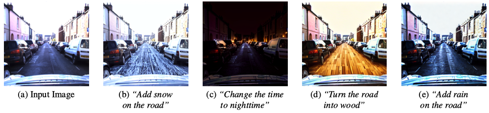

# Image-Editing Specialists: An RLAIF Approach for Diffusion Models
The official code for the paper [Image-Editing Specialists: An RLAIF Approach for Diffusion Models](https://arxiv.org/abs/2504.12833). You can directly fine-tune the diffusion model through AI model feedback without the need to train a reward model.



## Requirements
Requires Python 3.10 or newer.
```
git clone https://github.com/ebenarous/EditSpecialists.git
cd EditSpecialists
pip install -e .
```

## Setup
```
bash download_repos.sh
```
Our work leverages AI models to evaluate generated images. 
Some are accessed via [HuggingFace](https://huggingface.co/), others through their original repository manually.
The file `download_repos.sh` clones the repositories for models needed in both training and evaluation.
You can change the models used to provide structural and semantic feedback by modifying the functions in `EditSpecialists/reward_modeling`.

## Usage
### Training
```
accelerate launch scripts/train.py
```
This will start finetuning [InstructPix2Pix](https://github.com/timothybrooks/instruct-pix2pix) on all available GPUs using the config from `config/base.py`.
In `config/base.py`, you can specify the folders where your images are located, and the edit you want to specialize on. You can also create a custom dataloader by modifying `EditSpecialists/data/dataset.py`.
Note that the default hyperparameters are meant to get the code up and running quickly. You should adjust them to achieve better performance, especially the number of samples per epoch and gradient accumulation steps.
### Sampling
```
python scripts/generate.py
```
This inference-only command will edit images found in the provided folders, also using the config from `config/base.py`. Make sure to specify a checkpoint to load, else the default InstructPix2Pix model will be used for sampling.
### Evaluation
```
python scripts/evaluate.py
```
This will run the evaluation metrics on images found in the provided folders, using the config from `config/eval.py`.
The results are output as a json file.

## Parameter configuration
### Batch Sizes and Accumulation Steps
Each epoch iterates over 1) generating a batch of images, 2) computing their rewards, 3) and then doing some training steps on those images. A key hyperparameter is the number of images produced per epoch, which should be sufficiently high to accurately estimate the average reward and the policy gradient. Another important hyperparameter is the number of training steps in each epoch.

However, these are not defined explicitly but are instead defined implicitly by several other hyperparameters. First note that all batch sizes are per GPU. Therefore, the total number of images generated per epoch is sample.batch_size * num_gpus * sample.num_batches_per_epoch. The effective total training batch size (if you include multi-GPU training and gradient accumulation) is train.batch_size * num_gpus * train.gradient_accumulation_steps. The number of training steps per epoch is the first number divided by the second number, or (sample.batch_size * sample.num_batches_per_epoch) / (train.batch_size * train.gradient_accumulation_steps).

These are implicitly determined by various other hyperparameters. Batch sizes are referred to on a per-GPU basis. Consequently, the total count of images generated per epoch is calculated as `sample.batch_size * num_gpus * sample.num_batches_per_epoch`. When considering multi-GPU training and gradient accumulation, the effective total training batch size is `train.batch_size * num_gpus * train.gradient_accumulation_steps`. The number of training steps per epoch, is `(sample.batch_size * sample.num_batches_per_epoch) / (train.batch_size * train.gradient_accumulation_steps)`. If `train.num_inner_epochs > 1`, the training will loop over the same batch of images multiple times before generating a new batch, and the number of training steps per epoch increases accordingly.

At the beginning of each training run, the script will print out the calculated value for the number of images generated per epoch, the effective total training batch size, and the number of training steps per epoch. Make sure to double-check these numbers!

The results presented on [our paper](https://arxiv.org/abs/2504.12833) were achieved with a total training batch size of 256, and experiments were conducted on A100 & H100 NVIDIA GPUs.

### Objective function Hyperparameters
`train.score_alpha` and `train.rec_lambda` parameters weigh the relative importance of the semantic, structural and reconstruction scores, they can be slightly adjusted based on the model’s zero-shot capabilities to further optimize learning convergence.

## Citation
If you find our work or any of our materials useful, please cite our paper:
```
@misc{benarous2025imageeditingspecialistsrlaifapproach,
      title={Image-Editing Specialists: An RLAIF Approach for Diffusion Models}, 
      author={Elior Benarous and Yilun Du and Heng Yang},
      year={2025},
      eprint={2504.12833},
      archivePrefix={arXiv},
      primaryClass={cs.CV},
      url={https://arxiv.org/abs/2504.12833}, 
}
```

## Acknowledgements
Our code takes inspiration from the [D3PO](https://github.com/yk7333/d3po/) and [DDPO](https://github.com/kvablack/ddpo-pytorch) repositories.
